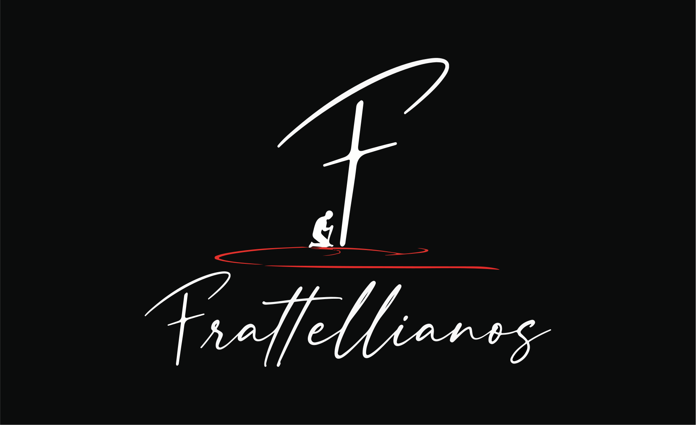

# Frattellianos



Site institucional da comunidade cristã Frattellianos, criado para apresentar sua história, propósito e mensagem de forma simples, acolhedora e responsiva.

## Sobre o projeto

Frattellianos nasceu de um sonho entre amigos e ganhou novo significado com a missão de aproximar pessoas de Cristo. O site reúne essa trajetória, apresenta missão, visão e valores da comunidade e oferece acesso à Palavra e à estrutura dos livros da Bíblia.

## Tecnologias

- [Next.js 16](https://nextjs.org/)
- [React 19](https://react.dev/)
- [TypeScript](https://www.typescriptlang.org/)
- [Tailwind CSS 4](https://tailwindcss.com/)

## Requisitos

Antes de começar, instale:

- [Git](https://git-scm.com/downloads)
- [Node.js](https://nodejs.org/) 20.9 ou superior — npm já acompanha instalação

Confirme instalações:

```bash
git --version
node --version
npm --version
```

## Executando localmente

```bash
git clone https://github.com/iweti-com/Frattellianos.git
cd Frattellianos
npm ci
npm run dev
```

Acesse [http://localhost:3000](http://localhost:3000) no navegador.

Clone por HTTPS não exige chave SSH para repositório público.

## Scripts

| Comando         | Descrição                             |
| --------------- | ------------------------------------- |
| `npm run dev`   | Inicia ambiente de desenvolvimento    |
| `npm run build` | Gera build otimizado de produção      |
| `npm run start` | Inicia servidor com build de produção |

## Rotas

| Rota              | Estado     | Descrição                                   |
| ----------------- | ---------- | ------------------------------------------- |
| `/`               | Disponível | Redireciona para página de história         |
| `/historia`       | Disponível | História e apresentação do Frattellianos    |
| `/mensagem`       | Disponível | Missão, visão e valores da comunidade       |
| `/palavra`        | Disponível | Mensagens e versículos diários              |
| `/biblia`         | Disponível | Lista de livros do Antigo e Novo Testamento |
| `/biblia/[livro]` | Disponível | Lista de capítulos do livro selecionado     |

## Estrutura

```text
Frattellianos/
├── public/
│   ├── icons/
│   └── images/
├── src/
│   ├── app/          # páginas e layouts da aplicação
│   ├── components/   # componentes visuais e de layout
│   ├── content/      # conteúdo bíblico e versículos
│   └── lib/          # utilitários internos
├── package.json
└── postcss.config.mjs
```

## Estado atual

- Páginas institucionais responsivas implementadas.
- Navegação por livros e capítulos da Bíblia implementada.
- Identidade visual e estilos construídos com Tailwind CSS.
- Conteúdo bíblico mantido localmente, sem backend.
